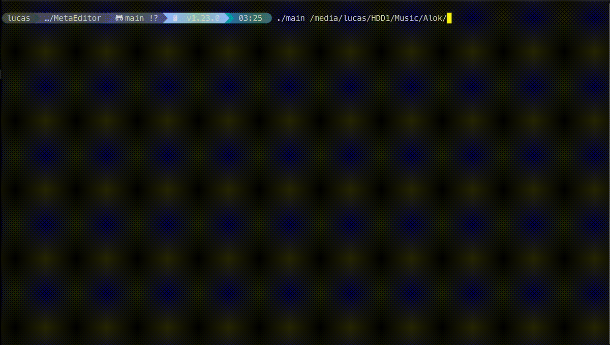

# MetaEditor

A simple terminal application to edit your mp3 music files metadata and organize them in a structured way.

- ✅ Follows the ID3v2 standard
- ❤️ Written in Golang
- 🚀 Executes batch operations in Parallel

<div align="center" width="100%">
  
</div>

## Installation

1. Clone the repository

```
    git clone https://github.com/lnardon/MetaEditor.git
```

2. Build the app

```
    cd MetaEditor
    make build
```

3. Run the app passing the path to the directory containing the mp3 files

```
    ./main /path/to/mp3/files
```
